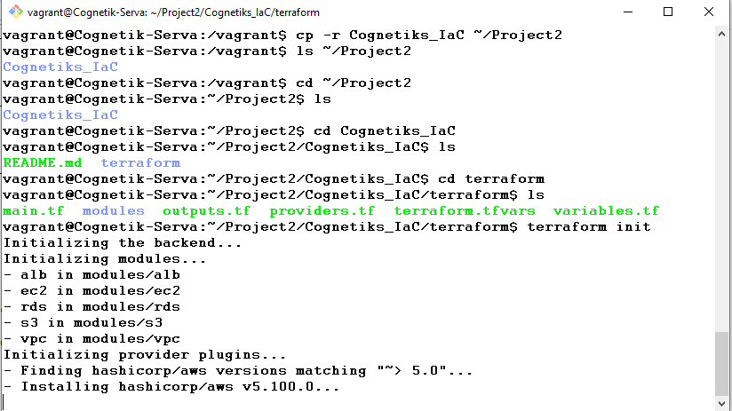

# Task 1- IaC with Terraform Modular Architecture

# Django on AWS with Terraform & EKS

This document provides a step-by-step guide for deploying a Django application on AWS using Terraform, EC2, RDS, S3, and an Elastic Load Balancer (ELB).

---

## 1. Project Overview

I automated infrastructure provisioning using **Terraform**.  

The deployed resources include:

- **VPC, Subnets, Internet Gateway, NAT Gateway**
- **EC2 instances (Ubuntu Jammy) running Django via Gunicorn**
- **RDS PostgreSQL database**
- **S3 bucket for static/media files**
- **Elastic Load Balancer (ELB) for high availability**
- **CloudWatch for logging and monitoring**

---

## 2. Prerequisites

- AWS CLI installed and configured with IAM user credentials  
- Terraform installed  
- Git installed  
- A valid AWS Key Pair for EC2 access

---

## 3. Clone Repository

```bash
git clone https://github.com/cognetiks/Technical_DevOps_app.git
cd Technical_DevOps_app/terraform
```

---

## 4. Configure Terraform

We structured Terraform into modules:

- **network/** – VPC, subnets, NAT gateway, etc.  
- **ec2/** – EC2 launch templates, security groups, Auto Scaling  
- **rds/** – PostgreSQL database  
- **s3/** – Static and media file storage  
- **alb/** – Application load balancer

---

## 5. Deploy Infrastructure

```bash
terraform init
terraform validate
terraform plan
terraform apply -auto-approve
```

✅ At the end of this step, Terraform will output:

- **ELB DNS name**  
- **RDS endpoint**  
- **S3 bucket name**  

---

## 6. User Data Script (EC2 Setup)

Each EC2 instance installs and runs Django using **Gunicorn**:

```bash
#!/bin/bash
set -e
exec > >(tee /var/log/userdata.log|logger -t userdata -s 2>/dev/console) 2>&1

# Update system
apt-get update -y
apt-get upgrade -y

# Install dependencies
apt-get install -y python3-pip python3-venv python3-dev git curl unzip \
                   build-essential libpq-dev nginx

# Clone repo
PROJECT_DIR="/home/ubuntu/Cognetiks_DevOps_App"
rm -rf $PROJECT_DIR
git clone https://github.com/IKUKU1010/Cognetiks_DevOps_App.git $PROJECT_DIR

# Setup venv
cd $PROJECT_DIR
python3 -m venv venv
source venv/bin/activate
pip install --upgrade pip
pip install -r requirements.txt gunicorn boto3

# Django setup
python manage.py migrate
python manage.py collectstatic --noinput

# Systemd service for Gunicorn
cat > /etc/systemd/system/gunicorn.service <<EOF
[Unit]
Description=gunicorn daemon for Django
After=network.target

[Service]
User=ubuntu
Group=www-data
WorkingDirectory=$PROJECT_DIR
ExecStart=$PROJECT_DIR/venv/bin/gunicorn --workers 3 --bind 0.0.0.0:8000 Cognetiks_DevOps_App.wsgi:application

[Install]
WantedBy=multi-user.target
EOF

# Enable and start Gunicorn
systemctl daemon-reload
systemctl enable gunicorn
systemctl start gunicorn

```

---

## 7. Security Group Rules

- **Port 22** → SSH  
- **Port 80/443** → HTTP/HTTPS  
- **Port 8000** → Django/Gunicorn  
- Outbound traffic → allowed for internet access

---

## 8. Django ALLOWED_HOSTS

In `settings.py`, ensure the ELB DNS name is added:

```python
ALLOWED_HOSTS = ["cognetiks-iac-elb-xxxxx.us-east-1.elb.amazonaws.com"]
```

---

## 9. S3 Integration

Django is configured to upload static/media files to S3. Example:

```python
AWS_STORAGE_BUCKET_NAME = "cognetiks-static-bucket"
AWS_S3_REGION_NAME = "us-east-1"
AWS_ACCESS_KEY_ID = "<your-access-key>"
AWS_SECRET_ACCESS_KEY = "<your-secret-key>"
```

Run:

```bash
python manage.py collectstatic
```

---

## 10. Verification

1. Visit the **ELB DNS name** in your browser  
2. Ensure Django home page loads  
3. Verify static files load from S3  
4. Check RDS connectivity from Django logs

---

## 11. Monitoring & Logging

- CloudWatch Agents will be installed on the nodes to monitor EC2, RDS, and ELB metrics  
- Application logs are pushed via CloudWatch Agent

---

## 12. Destroy Infrastructure

When finished, clean up resources:

```bash
terraform destroy -auto-approve
```

---

## 13. Project Architecture


---

## 14. Screenshots


- 
-   
-   
-   
-   
-   
-   
-   
-   
-   
-   
-   
-   
-   
-   
-   
-   
-   
-   
-  

---

## 15. Continuous improvement

- There is much work still to do on this project and I will continue to improve on the application**  
 
